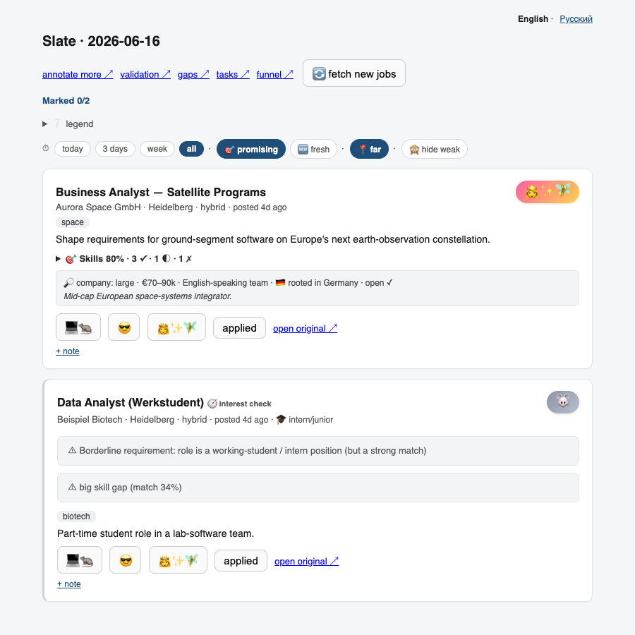
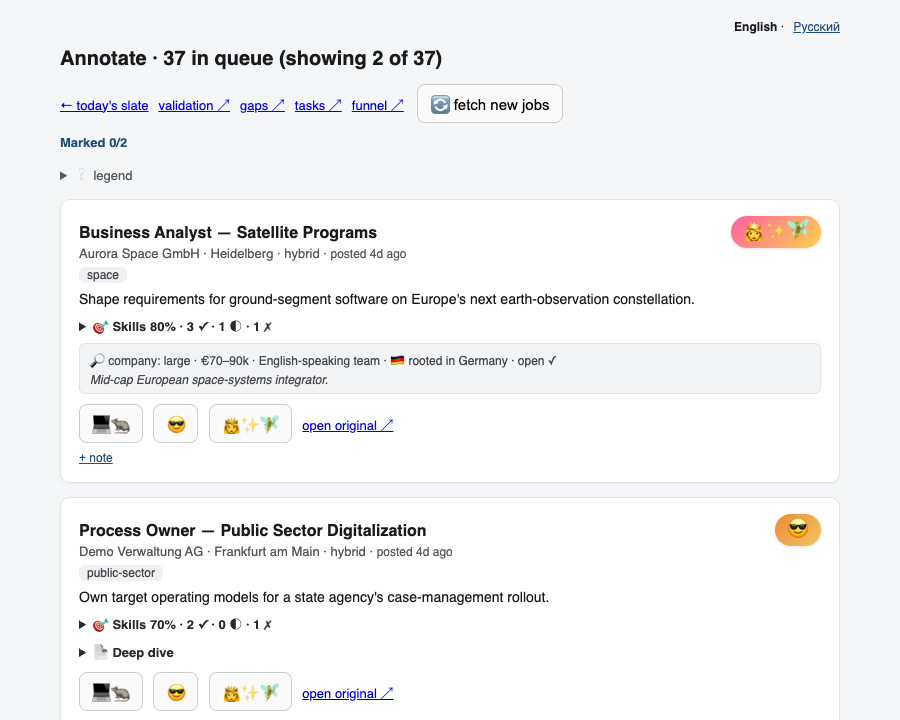
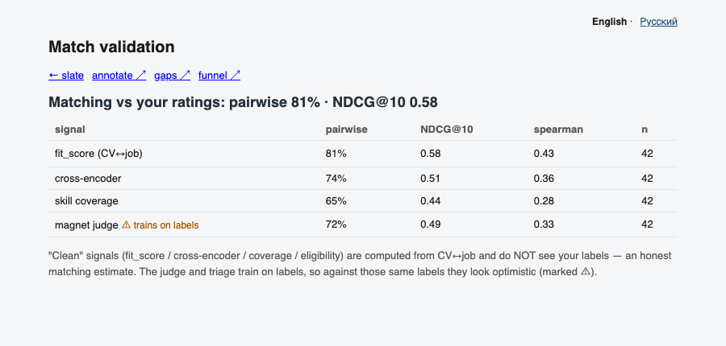
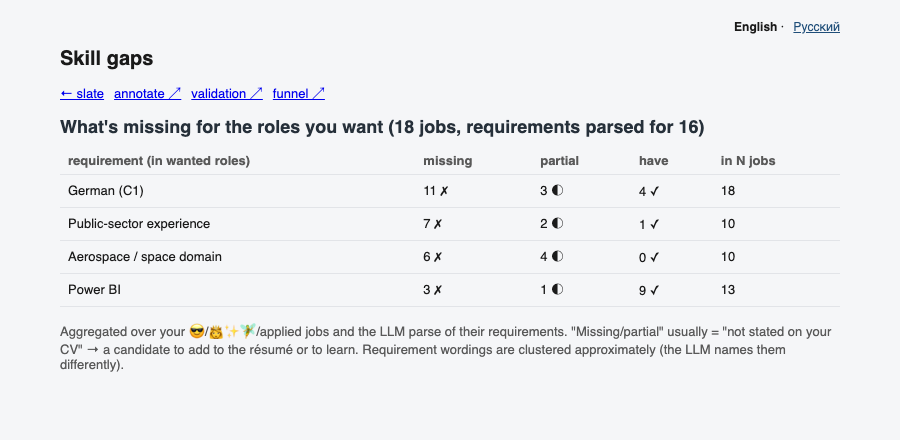

# Schabaschkascuhen

Local, zero-cost dream-job finder for the Heidelberg/Frankfurt market.

It collects jobs nightly, filters and deduplicates them, scores CV fit locally, then shows a small daily slate for the user to rate. Ratings train the gate and calibrate the ranking over time. The UI is English by default with a Russian toggle.

## Screenshots

Generated from synthetic demo data:

```bash
python -m scripts.gen_screenshots
```

<table>
  <tr>
    <td><a href="docs/screenshots/slate.png"></a><br><b>Daily slate</b></td>
    <td><a href="docs/screenshots/annotate.png"></a><br><b>Annotation queue</b></td>
  </tr>
  <tr>
    <td><a href="docs/screenshots/eval.png"></a><br><b>Match validation</b></td>
    <td><a href="docs/screenshots/gaps.png"></a><br><b>Skill gaps</b></td>
  </tr>
</table>

## Install

```bash
python3 -m venv .venv
source .venv/bin/activate
pip install -e ".[dev,v2]"
pip install "git+https://github.com/Vlislavn/JobSpy.git"
ollama pull qwen3:8b
cp config/profile.example.yaml config/profile.yaml
```

Optional deep-search integration:

```bash
pip install -e ~/code/work/KatherLab/prototype-internal-KL
```

## Use

```bash
schabasch serve   # http://127.0.0.1:8787
schabasch tick    # scrape, score, investigate, build today's slate
```

Main pages:

- `/` - daily slate
- `/annotate` - rating queue
- `/eval` - ranking validation against your labels
- `/gaps` - repeated missing requirements in wanted roles

## More Docs

- [Use case](docs/USE_CASE.md)
- [Annotation guide](docs/ANNOTATION.md)
- [Roadmap](docs/ROADMAP.md)
- [Import audit](docs/IMPORT_AUDIT.md)
